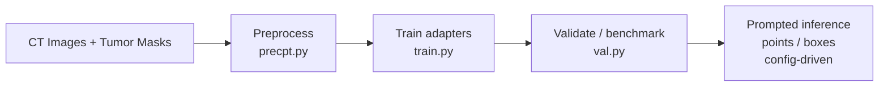

# DiSCo / PEFT Adapters for SAM on CT Liver Tumor Segmentation

PEFT adapters (Conv-Adapter / LoRA / QLoRA / DiSCo) for **SAM/MedSAM-style** CT liver tumor segmentation with prompt-driven evaluation and accuracy–efficiency benchmarking.


---

## GitHub “About” (copy/paste)

PEFT adapters (Conv-Adapter / LoRA / QLoRA / DiSCo) for SAM-style CT liver tumor segmentation with prompt-driven evaluation and accuracy–efficiency benchmarking.

---

## Discoverability (GitHub topics + hashtags)

**GitHub Topics (recommended):** add these in **GitHub → Settings → Topics**  
`medical-imaging, segmentation, liver, tumor-segmentation, ct, computed-tomography, foundation-model, segment-anything, sam, medsam, peft, adapters, lora, qlora, pytorch, parameter-efficient-finetuning, promptable-segmentation`

**Hashtags (optional for posts):**  
`#medicalimaging #segmentation #CT #liver #tumorsegmentation #SAM #MedSAM #PEFT #LoRA #QLoRA #PyTorch`

---

## Paper

**Parameter-Efficient Fine-Tuning of Foundation Models for Liver Tumor Segmentation in CT**  
Ramtin Mojtahedi, Mohammad Hamghalam, Jacob J. Peoples, Richard K. G. Do, Amber L. Simpson

This repository adapts a **frozen SAM/MedSAM-style backbone** to CT liver tumor segmentation using **parameter-efficient fine-tuning (PEFT)**. Only lightweight adapter parameters are trained, enabling fast, low-memory adaptation and prompt-driven workflows.

> **Dataset note:** The in-house CRLM CT dataset used in the paper is **not included**.  
> You can run the same pipeline on your own dataset by configuring paths in `cfg.py`.

---

## What’s included

- PEFT training with a **frozen foundation segmentation backbone**
- Adapter implementations used in the study (**Conv-Adapter**, **LoRA**, **QLoRA**, **DiSCo**)
- Training + validation entry points
- One analysis notebook for tumor experiments



---

## Repository contents

On Windows, Python extensions may be hidden (e.g., `cfg` → `cfg.py`).

```text
.
├── Abdominal_Liver_sam_128.pth
├── cfg.py
├── function.py
├── MedSAM2D_Tumours.ipynb
├── precpt.py
├── train.py
├── utils.py
└── val.py
```

---

## File guide

- `cfg.py` — Central configuration (paths, hyperparameters, adapter selection, prompt/eval settings).
- `function.py` — Core model + training/evaluation logic (adapters, prompting utilities, loss/metrics wiring).
- `utils.py` — Shared utilities (I/O, transforms, logging, metrics helpers, timing, etc.).
- `precpt.py` — Preprocessing script (raw data → training/evaluation format).
- `train.py` — Training entry point (typical: freeze backbone → train only adapter parameters).
- `val.py` — Validation/evaluation entry point (segmentation metrics + optional compute metrics).
- `MedSAM2D_Tumours.ipynb` — Notebook for experiments, debugging, visualization, and analysis.
- `Abdominal_Liver_sam_128.pth` — Checkpoint/weights used in experiments (see checkpoint notes).

---

## Setup

### 0) Clone

```bash
git clone <YOUR_REPO_URL>
cd <YOUR_REPO_FOLDER>
```

### 1) Create a clean environment (recommended)

```bash
conda create -n disco-peft-sam python=3.10 -y
conda activate disco-peft-sam
python -m pip install -U pip
```

### 2) Install PyTorch

Install a PyTorch build that matches your system (CPU or CUDA). Example:

```bash
pip install torch torchvision
```

### 3) Install common dependencies

```bash
pip install numpy scipy opencv-python scikit-image matplotlib tqdm pyyaml
```

Optional (for notebooks):

```bash
pip install notebook ipykernel
python -m ipykernel install --user --name disco-peft-sam
```

### 4) Sanity checks (recommended)

From the repo root:

```bash
python -c "import torch; print('torch:', torch.__version__); print('cuda:', torch.cuda.is_available())"
python -m compileall .
```

---

## Data expectations

Because datasets differ, the most reliable reference is the dataset-loading logic inside `utils.py` / `function.py` and the path configuration in `cfg.py`.

In general, the pipeline expects paired 2D images and binary tumor masks, with consistent sizing.

Recommended layout:

```text
data/
  images/   (CT slices)
  labels/   (binary masks aligned with images)
```

Conventions:
- `images/` and `labels/` contain matching filenames (e.g., `0001.png` ↔ `0001.png`)
- masks are binary (`0` background, `1` tumor) unless configured otherwise
- if your loader expects a manifest (JSON/CSV), keep it next to the data and point to it in `cfg.py`

---

## Preprocessing

Open `cfg.py` and set:
- input data paths
- output directory for preprocessed slices/masks
- any preprocessing parameters used by your workflow

Run preprocessing:

```bash
python precpt.py
```

Typical CT → 2D preprocessing may include:
- intensity clipping (HU range) and scaling
- cropping to reduce search space (e.g., liver ROI when available)
- resizing/export to a fixed resolution suitable for SAM-style backbones

---

## Training

Open `cfg.py` and configure:
- dataset paths
- output/log directory
- adapter type (Conv-Adapter / LoRA / QLoRA / DiSCo)
- training hyperparameters (epochs, lr, batch size, seed)
- prompt regime settings (if applicable)

Run training:

```bash
python train.py
```

Typical outputs:
- adapter checkpoints
- training logs and validation summaries

---

## Validation / Evaluation

Run evaluation:

```bash
python val.py
```

Typical evaluation reports:
- Dice
- HD95
- (optional) compute metrics such as latency / throughput / peak GPU memory, if implemented/enabled

For fair benchmarking across adapters:
- keep the same input resolution
- keep batch size and device consistent
- keep prompt settings consistent

---

## Notebook workflow

Use the notebook for interactive experiments and visualization:

- `MedSAM2D_Tumours.ipynb`

Checklist:
- confirm dataset paths are correct
- load a few samples and visualize image + mask
- run a short train/val pass
- visualize predictions (and prompts if used)

---

## Paper snapshot (optional)

Keep short; update to match finalized runs.

| Adapter       | Strength                           | Trade-off                                        |
|--------------|------------------------------------|--------------------------------------------------|
| Conv-Adapter  | strong absolute accuracy            | more trainable params than ultra-light methods   |
| LoRA          | strong accuracy, simple integration | can be heavier depending on rank/insertion sites |
| QLoRA         | strong efficiency profile           | quantization adds implementation complexity      |
| DiSCo         | excellent parameter efficiency      | lower absolute accuracy in ultra-low param settings |

---

## Checkpoints

`Abdominal_Liver_sam_128.pth` may be large; for public repos, avoid committing large binaries directly to git history.

Recommended options:
- Git LFS
- GitHub Releases
- external storage + checksum (e.g., SHA256)

If private/dataset-specific, keep it local and add it to `.gitignore`.

---

## Reproducibility tips

- Use patient-level splits if you have multiple slices per patient/case
- Fix and log:
  - random seed(s)
  - input resolution
  - adapter type + rank/scaling settings
  - prompt regime settings
  - device + batch size
- Keep evaluation conditions identical across adapters (same resolution, prompts, device)

---

## Citation

Update venue / DOI / arXiv once finalized:

```bibtex
@inproceedings{mojtahedi_peft_sam_liver_ct,
  title  = {Parameter-Efficient Fine-Tuning of Foundation Models for Liver Tumor Segmentation in CT},
  author = {Mojtahedi, Ramtin and Hamghalam, Mohammad and Peoples, Jacob J. and Do, Richard K. G. and Simpson, Amber L.},
  year   = {2026}
}
```

---

## Acknowledgments

This work was funded by the National Institutes of Health / National Cancer Institute (R01CA233888, U01CA238444).

---

## License

No license file is currently included in this repository. If you plan to share or reuse this code publicly, add a `LICENSE` file (e.g., MIT or Apache-2.0) and update the badge at the top.

---

## Contact

For questions or issues, please open a GitHub Issue.  
Correspondence: `ramtinrms@gmail.com`
