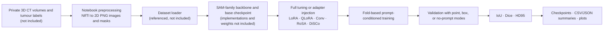

<picture>
  
</picture>

**Research snapshot · Liver CT segmentation**

[Profile](https://github.com/Ramtin-Mojtahedi) · [Project directory](https://github.com/Ramtin-Mojtahedi/Ramtin-Mojtahedi/blob/main/REPOSITORY_INDEX.md) · [Paper](https://doi.org/10.1117/12.3087835)

# Parameter-efficient fine-tuning of foundation models for liver tumor segmentation in CT

[](https://doi.org/10.1117/12.3087835)


Research code associated with:

> Ramtin Mojtahedi, Mohammad Hamghalam, Jacob J. Peoples, Richard K. G. Do, and Amber L. Simpson. “Parameter-efficient fine-tuning of foundation models for liver tumor segmentation in CT.” *Medical Imaging 2026: Computer-Aided Diagnosis*, Proceedings of SPIE, vol. 13926, pp. 260–268, article 1392612, 2026. [https://doi.org/10.1117/12.3087835](https://doi.org/10.1117/12.3087835)

<!-- repository-guide:start -->
## At a glance

[Paper](https://doi.org/10.1117/12.3087835) · [Code map](#what-is-included) · [Missing components](#missing-runtime-components) · [Environment assumptions](#hard-coded-environment-assumptions) · [Data and weights](#data-and-model-availability) · [`CITATION.cff`](CITATION.cff)

### Dependency evidence

| Area | Packages imported by committed files |
|---|---|
| Training and evaluation | `torch`, `torchvision`, `monai`, `numpy`, `scikit-learn`, `scikit-image`, `Pillow`, `einops`, `tensorboardX`, `matplotlib`, `seaborn`, `tqdm`, `python-dateutil` |
| Adapters and profiling | `peft`, `transformers`; conditional `bitsandbytes`; optional `ptflops` |
| Notebook analysis | `nibabel`, `scipy`, `pandas` |
| Perceptual helper | `lucent` |
| Unresolved references | `pytorch_ssim` and the absent local `dataset`, `conf`, and `models` modules |

No versions are pinned; this table is an import inventory, not a tested installation specification.

### Workflow represented by the snapshot


```mermaid
flowchart LR
    A["Private 3D CT volumes and tumour labels<br/>(not included)"] --> B["Notebook preprocessing<br/>NIfTI to 2D PNG images and masks"]
    B --> C["Dataset loader<br/>(referenced, not included)"]
    C --> D["SAM-family backbone and base checkpoint<br/>(implementations and weights not included)"]
    D --> E["Full tuning or adapter injection<br/>LoRA · QLoRA · Conv · RoSA · DiSCo"]
    E --> F["Fold-based prompt-conditioned training"]
    F --> G["Validation with point, box, or no-prompt modes"]
    G --> H["IoU · Dice · HD95"]
    H --> I["Checkpoints · CSV/JSON summaries · plots"]
```

> **Reproducibility boundary:** the diagram documents committed control flow, not a runnable recipe. Missing local modules, private data, base weights, absolute paths, and an unpinned environment prevent reproduction from a fresh clone.
<!-- repository-guide:end -->

## Repository status

> **Important:** this repository is an archival research snapshot. It is **not a standalone or turnkey implementation**, and it cannot reproduce the paper from a fresh clone.

The snapshot preserves selected experiment code for adapting SAM/MedSAM-style segmentation models to CT liver-tumor segmentation. It contains configuration, training, validation, adapter, metric, and notebook code, but it does not contain the complete runtime used in the study.

Specifically:

- the in-house colorectal liver metastasis CT images, tumor masks, patient-level splits, and clinical metadata are not included;
- the dataset loader, model implementations, runtime settings module, and one imported SSIM module are absent;
- SAM/MedSAM checkpoints and trained adapter checkpoints are not versioned here;
- there is no dependency lockfile, requirements file, container, or tested environment specification;
- several source files and notebook cells contain workstation-specific absolute paths; and
- no software license has been declared.

Treat this repository as a transparent record of selected research code, not as a validated clinical product or a fully reproducible package.

## What is included

| Path | Contents |
|---|---|
| `cfg.py` | Command-line configuration for model, adapter, optimization, prompts, cross-validation, and data paths. |
| `train.py` | Training and cross-validation orchestration, checkpointing, result export, and experiment summaries. |
| `val.py` | Checkpoint-loading and validation entry point. |
| `function.py` | SAM-style training and validation functions, prompting, loss wiring, and evaluation logic. |
| `utils.py` | Adapter implementations, model assembly helpers, metrics, logging, plotting, checkpoint utilities, and MONAI helpers. |
| `precpt.py` | VGG/Lucent-based perceptual-loss helper. Despite its filename, it is not a complete dataset-preprocessing pipeline. |
| `MedSAM2D_Tumours.ipynb` | Historical data-preparation, experiment-launch, evaluation, aggregation, and visualization notebook with retained cell outputs. |
| `CITATION.cff` | Machine-readable citation metadata for the accompanying paper. |

## Missing runtime components

The following imports are referenced by the committed source but are not present in this snapshot:

| Referenced component | Used by | Why it matters |
|---|---|---|
| `dataset.py` / `dataset` | `train.py`, `val.py`, `precpt.py` | Defines dataset classes and `get_dataloader`; without it, the input schema and split logic are unavailable. |
| `conf.py` / `conf.settings` | `train.py`, `val.py`, `function.py` | Supplies runtime settings such as timestamps and output conventions. |
| `models/` | `function.py`, `utils.py` | Supplies SAM, EfficientSAM, and MobileSAM model code and transforms. |
| `pytorch_ssim` | `function.py` | Imported by the loss/evaluation code but neither included nor pinned as a dependency. |

The code also imports third-party packages including PyTorch, torchvision, MONAI, Transformers, scikit-learn, scikit-image, tensorboardX, einops, Pillow, NumPy, Matplotlib, seaborn, tqdm, python-dateutil, and Lucent. Their exact versions are not recorded.

Because `dataset.py` is missing, a reliable input-directory contract cannot be inferred from this repository alone. Do not assume that a generic `images/` and `labels/` layout will reproduce the study.

## Hard-coded environment assumptions

Before attempting any reconstruction, review and replace the following:

- `train.py` writes experiments beneath `/mnt/largedrive1/rmojtahedi/medsam_adapter`.
- `MedSAM2D_Tumours.ipynb` contains numerous `/mnt/largedrive0/...`, `/mnt/largedrive1/...`, and `/home/rmojtahedi/...` paths for private data, checkpoints, cached weights, and results.
- `cfg.py` defaults to `../data` and `sam_vit_b_01ec64.pth`; neither target is included.
- `utils.py` contains a historical example checkpoint path under `./logs/siren_train_init_2022_08_19_21_00_16/...`.
- Retained notebook outputs refer to experiment directories and checkpoints that are not part of this repository.

These paths document the original workstation layout; they are not portable configuration defaults.

## Clone for inspection

```bash
git clone https://github.com/Ramtin-Mojtahedi/peft-sam-liver-ct.git
cd peft-sam-liver-ct
```

A successful clone does not make the training or validation commands runnable. To reconstruct the environment, a researcher would need to:

1. obtain authorized access to the study data, masks, and exact patient-level splits;
2. restore the missing `dataset`, `conf`, `models`, and `pytorch_ssim` components in versions compatible with this snapshot;
3. obtain the exact SAM/MedSAM base weights and study checkpoints;
4. replace every absolute data, checkpoint, cache, and output path;
5. reconstruct and record a compatible dependency environment; and
6. verify all configuration values against the paper and original experiment records.

Until those pieces are restored, `python train.py`, `python val.py`, and the notebook should be expected to fail or to produce non-comparable results.

## Data and model availability

The patient CT data and annotations used in the study are not distributed in this repository. They may be subject to institutional approvals, privacy constraints, and data-use agreements. Do not add identifiable or restricted clinical data to a public fork.

No base-model or trained-adapter weight file is committed in this snapshot. Any separately obtained weights remain subject to their own terms and provenance requirements.

For access questions, consult the paper and contact the authors.

## Citation

If this repository informs your work, cite the accompanying paper:

```bibtex
@inproceedings{mojtahedi2026parameter,
  author    = {Mojtahedi, Ramtin and Hamghalam, Mohammad and Peoples, Jacob J. and Do, Richard K. G. and Simpson, Amber L.},
  title     = {Parameter-efficient fine-tuning of foundation models for liver tumor segmentation in {CT}},
  booktitle = {Medical Imaging 2026: Computer-Aided Diagnosis},
  series    = {Proceedings of SPIE},
  volume    = {13926},
  pages     = {260--268},
  year      = {2026},
  publisher = {SPIE},
  doi       = {10.1117/12.3087835},
  url       = {https://doi.org/10.1117/12.3087835}
}
```

GitHub can also expose this citation through `CITATION.cff`.

## Funding

The associated work acknowledges support from the National Institutes of Health / National Cancer Institute under awards R01CA233888 and U01CA238444.

## License and reuse

**No license file or software license grant is included.** The repository’s public visibility does not by itself grant permission to copy, modify, redistribute, or incorporate the code into another project. Unless an exception in applicable law applies, obtain permission from the relevant rights holders before reuse.

For permissions or research questions, contact the authors or open an issue with the repository owner.
